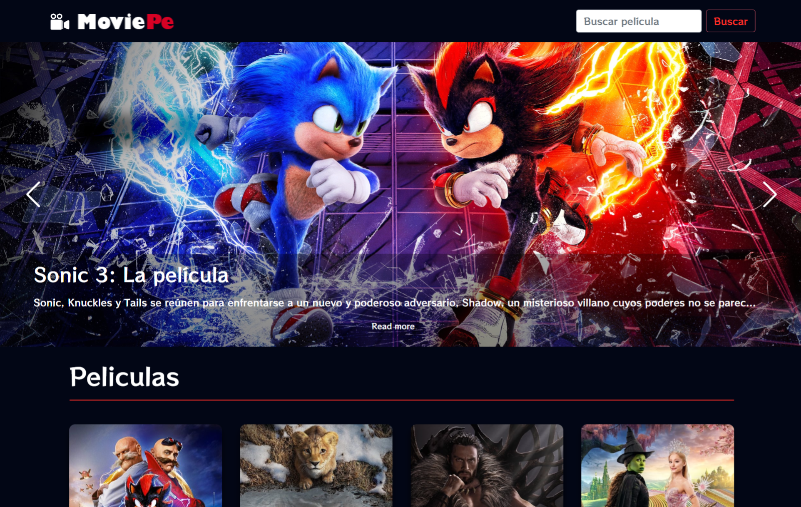

# MoviePe

This project was generated with [Angular CLI](https://github.com/angular/angular-cli) version 12.2.18.

### DEMO: [MoviePe](https://moviepe.netlify.app/)



### The following APIs were used:

> TMDB API --> https://movies-c6d33.firebaseapp.com/

> YouTube API --> https://gifyu.com/image/3nfr

## Implemented Dependencies: 
* ng-starrating
```
npm i ng-starrating
```
* swiperjs
```
npm i swiper
```

## Note: 
### Install dependencies for running this project
```
npm install
```